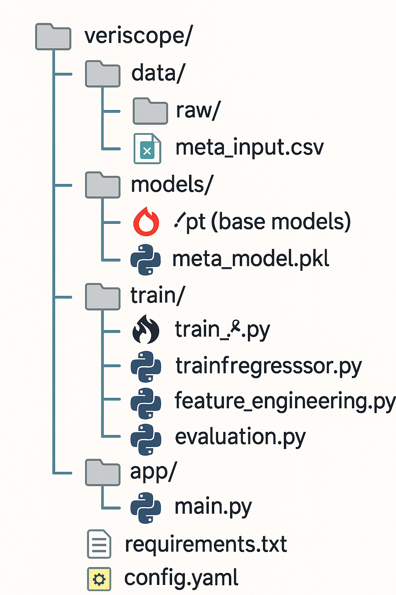

# Veriscope: Probabilistic Fake News Detection System

## Overview

Veriscope is a real-time, probabilistic fake news detection system. It predicts the veracity of social media claims on a continuous scale from 1.0 (true) to 0.0 (false), combining fine-tuned transformer models and a meta learning layer enhanced with mathematically derived credibility features.

## Problem Statement

Traditional fake news classifiers rely on binary or multi-class labels, which fail to capture the subtle spectrum of misinformation. Furthermore, they ignore speaker credibility history and contextual factors. Veriscope addresses these limitations by predicting a probabilistic veracity score using ensemble learning, thereby offering a more accurate and flexible solution for misinformation detection.

## Dataset: LIAR

**Source**: LIAR dataset with 12,822 labeled claims

### Key Fields

- `claim`: Textual statement made by a public figure or entity
- `label`: Truthfulness rating (true, mostly-true, etc.)
- `speaker`, `party`, `state`: Metadata
- `true_count`, `false_count`, etc.: Speaker history
- `context`: Statement medium (e.g., tweet, release)

### Label Conversion

- `true` → 1.0  
- `mostly-true` → 0.8  
- `half-true` → 0.6  
- `barely-true` → 0.4  
- `pants-fire` → 0.2  
- `false` → 0.0

---

## Methodology

### Step 1: Data Preprocessing

- Clean text (lowercasing, punctuation removal)
- Normalize labels to veracity scores
- Handle missing metadata

### Step 2: Mathematically Derived Features

**Credibility Score**

```
credibility_score = (1 * true + 0.8 * mostly_true + 0.6 * half_true +
                     0.4 * barely_true + 0.2 * pants_fire + 0 * false) / total_claims
```

**Liar Index**

```
liar_index = (false + pants_fire) / total_claims
```

**False-to-True Ratio**

```
false_true_ratio = (false + pants_fire) / (true + epsilon)
```

Where `epsilon = 1e-5`

**Entropy of Truthfulness**

```
H(p) = - Σ (p_i * log(p_i)) where p_i = label_count_i / total_claims
```

### Step 3: Base Models

Train 5 transformer models as regressors:

- BERT-base
- RoBERTa-base
- DistilBERT
- ALBERT
- Longformer

Each model predicts a score between 0 and 1 using MSE loss.

### Step 4: Meta Learner

**Input vector to meta model:**

```
x = [
  s_BERT, s_RoBERTa, s_DistilBERT, s_ALBERT, s_Longformer,
  credibility_score, liar_index, false_true_ratio, entropy
]
```

**Meta model options:**

- XGBoost Regressor
- LightGBM Regressor
- Linear Regression (baseline)

---

## Inference Pipeline

1. Accept input claim  
2. Clean and preprocess text  
3. Generate predictions from base models  
4. Compute mathematically derived features  
5. Feed all values into the meta learner  
6. Return veracity score ∈ [0.0, 1.0]  

---

## Evaluation Metrics

- Mean Squared Error (MSE)
- Mean Absolute Error (MAE)
- Pearson and Spearman Correlation
- AUROC (if thresholds are used)

---

## Folder Structure

## Folder Structure




---

## Expected Output

- Veracity score between 0.0 and 1.0  
- Optional: intermediate predictions from base models  
- Optional: flag for review based on threshold  

---

## Extensions

- Integrate claim matching with Wikipedia or ClaimReview  
- Graph-based analysis of content propagation  
- Feedback loop for human-in-the-loop validation  
- Frontend UI using Streamlit or Gradio  

---

## License

This project is open-source and available for academic and research use.
